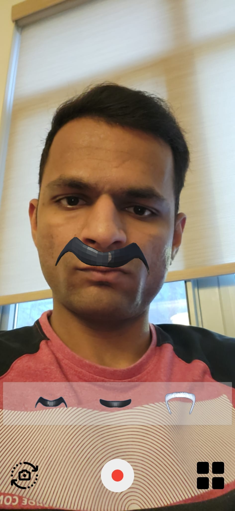
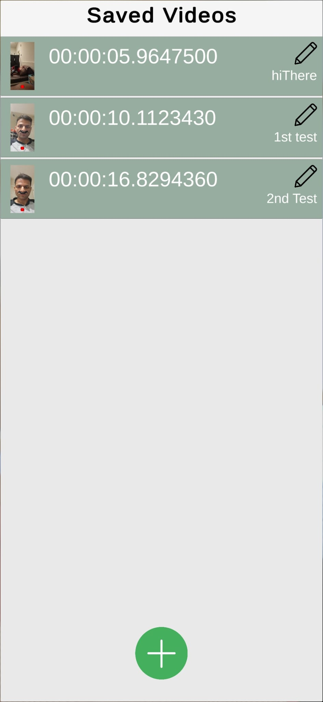
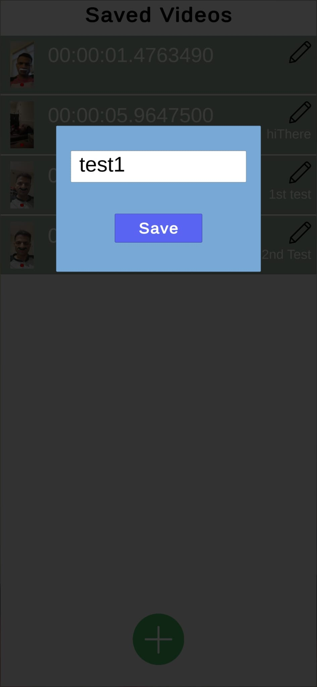

# Mustache Filter AR
An Augmented reality Face filter android app made with Unity and ARCore

## Getting Started
- Clone this repo:
    ```sh
    $ git clone https://github.com/rutvikp36/MustacheFilter.git
    ```
 - Open the project in [Unity.](https://unity.com/)
 - Change Build Settings to Android and give proper Android SDK path

## Sample Android App 
  - [MustacheFilter.apk](MustacheFilter.apk)

## Features
  - Detect anchor point using ARFaceManager
  - Choose from multiple mustaches
  - Record the session
  - Playback recorded sessions
  - Add a tag on each recording
  - Easy to install

## Snapshots

<p align="center">



</p>


<p align="center">

</p>


## Acknolegments
  - [Google ARCore - Augmented Faces developer guide for Unity](https://developers.google.com/ar/develop/unity/augmented-faces/developer-guide)
  - [LeanTween for UI Animations](https://dentedpixel.com/LeanTweenDocumentation/classes/LeanTween.html)
  - [3D Mustache Assets](https://creazilla.com/nodes/1539587-set-of-mustache-3d-model)
  - [Unity3D Documentations](https://docs.unity3d.com/Manual/index.html)
  - [Unity Answers](https://answers.unity.com/index.html)
  - [StackOverflow](https://stackoverflow.com)
    
   
